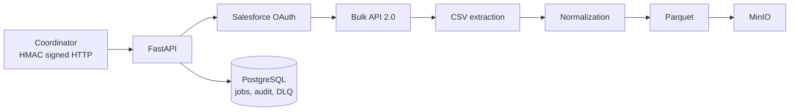

# Salesforce Master Service

On-demand Salesforce extraction service that authenticates with Salesforce, runs Bulk API 2.0 exports, downloads CSV results, normalizes records into relational table families, publishes Parquet files to MinIO, and tracks each run in PostgreSQL.

The Coordinator drives the service through signed HTTP requests. Scheduling, deduplication, PII masking, queues, and downstream processing are outside the specification.

## Architecture



Pipeline: Salesforce authentication -> Bulk API query jobs -> polling -> streamed CSV download -> extraction -> normalization -> Parquet -> MinIO -> `COMPLETED`.

## Technology

| Area | Implementation |
| --- | --- |
| Runtime | Python 3.11+, FastAPI, Uvicorn |
| Database | PostgreSQL, SQLAlchemy 2.0, Alembic |
| Salesforce | OAuth JWT Bearer or username/password; Bulk API 2.0 |
| Storage | MinIO; JSON or Parquet output via Pandas/PyArrow |
| Security | HMAC-SHA256 with Coordinator and Engineer roles |
| Resilience | Bounded retries, exponential delays, jitter, DLQ |
| Deployment | Docker, Compose, Nomad/Vault reference |

## Supported objects and tables

| Salesforce object | Output tables |
| --- | --- |
| Account | `accounts`, `account_addresses`, `account_teams` |
| Contact | `contacts`, `contact_roles` |
| Opportunity | `opportunities`, `opportunity_line_items`, `opportunity_contact_roles` |
| OpportunityLineItem | `opportunity_line_items` |
| Lead | `leads` |
| Case | `cases`, `case_comments` |
| Task | `tasks`, `events` |
| Event | `tasks`, `events` |
| Campaign | `campaigns`, `campaign_members` |
| User | `users` |

The default object list is configurable with `SF_BULK_SUPPORTED_OBJECTS`. Salesforce permissions and available records determine which tables contain rows.

## Job lifecycle

```text
PENDING -> BATCH_REQUESTED -> BATCH_PROCESSING -> BATCH_READY
-> DOWNLOADING -> DOWNLOADED -> EXTRACTING -> EXTRACTED
-> NORMALIZING -> NORMALIZED -> UPLOADING_TO_MINIO
-> UPLOADED_TO_MINIO -> COMPLETED
```

`FAILED` and `CANCELLED` are side states. Heartbeats support stale-job detection. Resume uses persisted checkpoints and requires fresh Salesforce credentials after a process restart; credentials are never persisted.

## API

All routes except `/api/health` and `/api/stats` require HMAC authentication. Coordinator credentials are required for writes; Engineer credentials are read-only.

| Method | Endpoint | Purpose |
| --- | --- | --- |
| POST | `/api/scan/start` | Create a scan and start background extraction |
| GET | `/api/scan/{scan_id}/status` | Read status and progress |
| POST | `/api/scan/{scan_id}/cancel` | Cancel locally and best-effort abort Salesforce jobs |
| POST | `/api/scan/{scan_id}/resume` | Resume a failed/cancelled scan |
| GET | `/api/scan/list` | Paginated scan listing |
| GET | `/api/scan/statistics` | Status counts |
| DELETE | `/api/scan/{scan_id}/remove` | Remove a terminal scan and local files |
| GET | `/api/batch/info` | Bulk API configuration |
| POST | `/api/normalization/{scan_id}/normalize` | Normalize and optionally upload |
| POST | `/api/normalization/{scan_id}/normalize/{object_name}` | Normalize one object |
| GET | `/api/normalization/{scan_id}/tables` | List normalized files |
| GET | `/api/normalization/supported-objects` | Output catalog |
| POST | `/api/maintenance/cleanup` | Remove old scans |
| POST | `/api/maintenance/detect-crashed` | Mark stale jobs failed |
| GET | `/api/key/verify` | Verify HMAC identity |
| POST | `/api/validate-credentials` | Validate Salesforce credentials and identity |
| GET | `/api/health` | Service, database, and MinIO health |
| GET | `/api/stats` | Uptime and counters |
| GET | `/api/audit/logs` | Audit log query |
| GET | `/api/audit/stats` | Audit aggregates |

Start requests contain `organization_id` and a `salesforce_credentials` object. With server-side JWT configuration, the request needs only `grant_type` and the authorized username. After extraction reaches `EXTRACTED`, call normalization with `output_format: "parquet"` and `upload_to_minio: true` to publish and complete the job.

## Security

Protected requests require `X-SF-Signature`, `X-SF-Timestamp`, `X-SF-Client-ID`, and `X-SF-Nonce`. The HMAC-SHA256 canonical string is:

```text
METHOD\nPATH\nTIMESTAMP\nNONCE\nSHA256(BODY)
```

Requests enforce timestamp freshness, nonce replay protection, body integrity, constant-time signature comparison, and role authorization. Authentication outcomes are audit logged. Salesforce credentials, JWT assertions, access tokens, private keys, passwords, and HMAC secrets are scrubbed from logs/DLQ payloads and are not stored in job configuration.

## Storage and persistence

Raw results are stored locally at:

```text
data/scans/{scan_id}/extracted/{object_name}.csv
```

MinIO keys use:

```text
salesforce/{table_name}/glynac_organization_id={organization_id}/processing_date={date}/{table_name}.parquet
```

PostgreSQL stores `jobs`, `audit_logs`, and `failed_external_calls`. Job records include batch ids, file metadata, extraction counts, stage timestamps, heartbeats, normalization statistics, and MinIO keys.

Salesforce and MinIO calls use bounded retries configured with `EXTERNAL_CALL_MAX_RETRIES`, `EXTERNAL_CALL_RETRY_DELAYS`, `EXTERNAL_CALL_MAX_DELAY_SECONDS`, and `EXTERNAL_CALL_JITTER`. Exhausted retryable calls are persisted to the scrubbed, size-capped DLQ.

## Configuration

Configuration is loaded from `.env` with Pydantic Settings. Important groups are:

| Group | Variables |
| --- | --- |
| App | `APP_ENV`, `LOG_LEVEL`, `APP_NAME`, `API_PREFIX`, `DEBUG` |
| Database | `DATABASE_URL`, `DB_POOL_SIZE`, `DB_MAX_OVERFLOW` |
| Salesforce | `SF_LOGIN_URL`, `SF_CLIENT_ID`, `SF_CLIENT_SECRET`, `SF_JWT_PRIVATE_KEY_PATH`, `SF_API_VERSION`, `SF_TIMEOUT_SECONDS` |
| Bulk API | `SF_BULK_POLL_INTERVAL_SECONDS`, `SF_BULK_MAX_WAIT_MINUTES`, `SF_BULK_SUPPORTED_OBJECTS` |
| MinIO | `MINIO_ENDPOINT`, `MINIO_ACCESS_KEY`, `MINIO_SECRET_KEY`, `MINIO_BUCKET`, `MINIO_SECURE` |
| Resilience | `EXTERNAL_CALL_MAX_RETRIES`, `EXTERNAL_CALL_RETRY_DELAYS`, `EXTERNAL_CALL_MAX_DELAY_SECONDS`, `EXTERNAL_CALL_JITTER`, `DLQ_PAYLOAD_MAX_BYTES` |
| HMAC | `HMAC_ENABLED`, `HMAC_SECRET_KEY_CORE`, `HMAC_SECRET_KEY_ENGINEER`, `HMAC_SIGNATURE_MAX_AGE`, `HMAC_CLIENT_CONFIG` |
| Health/data | `HEALTH_CHECK_DB_ENABLED`, `HEALTH_CHECK_MINIO_ENABLED`, `DATA_ROOT_DIR` |

Production and staging guardrails reject placeholder secrets, disabled HMAC, or enabled debug mode.

## Local development

Prerequisites: Python 3.11+ and Docker Desktop with Compose.

```powershell
python -m venv .venv
.\.venv\Scripts\Activate.ps1
pip install -e ".[dev]"
Copy-Item .env.example .env
docker compose up -d --build
docker compose exec app alembic upgrade head
Invoke-RestMethod http://localhost:8000/api/health | ConvertTo-Json -Depth 8
```

Compose exposes PostgreSQL on `5434`, MinIO API on `9000`, MinIO console on `9001`, and the service on `8000`. Inside Compose, the app uses `postgres:5432` and `minio:9000`. Native execution is available with `uvicorn src.app.main:app --reload --port 8000` after starting PostgreSQL and MinIO.

## Testing

```powershell
pytest -q
ruff check .
mypy src tests
python -m compileall -q src tests
docker compose config --quiet
git diff --check
```

The suite uses mocked Salesforce/MinIO calls for deterministic local verification. A real E2E test is still required for the target org, permissions, network, live data shape, and deployment environment.

## Production deployment

The multi-stage Dockerfile builds a minimal non-root runtime with a health check. The Nomad reference deploys one service task per environment and renders secrets from:

```text
secrets/data/salesforce/salesforce-master-service-{env}
```

Run Alembic migrations before serving traffic and configure `/api/health` as the Nomad health check. No scheduler, queue, Redis, Celery, Kafka, or Kubernetes layer is required.

## Troubleshooting

- Check `/api/health` before starting a scan.
- Generate a fresh nonce for every signed request and sign the exact path/body.
- If a scan remains in an active state after restart, inspect heartbeat data and run `/api/maintenance/detect-crashed`.
- If Salesforce jobs fail, check JWT app authorization, object permissions, API version, and Bulk API limits.
- If uploads fail, check the MinIO bucket, endpoint, credentials, and the recorded DLQ row.
- Rebuild the app image after source changes: `docker compose up -d --build app`.

See [REAL_E2E_TEST_GUIDE.md](REAL_E2E_TEST_GUIDE.md) for signed PowerShell requests and the complete manual acceptance procedure.

## Project structure

```text
src/app/api/routes/       FastAPI endpoints
src/app/salesforce/       OAuth, Bulk API, and SOQL
src/app/services/         Extraction, polling, files, jobs, normalization
src/app/normalization/    Object normalizers and catalog
src/app/storage/          MinIO client
src/app/security/         HMAC authentication
src/app/models/           Job, audit, and DLQ models
alembic/                  Database migration
deploy/nomad/             Nomad/Vault reference
tests/                    Automated tests
```
