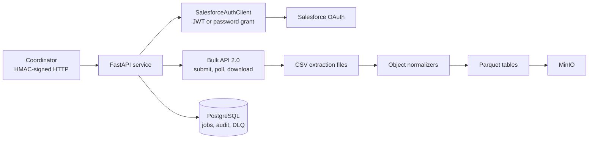

# Salesforce Master Service

On-demand Salesforce extraction service that authenticates with Salesforce, runs Bulk API 2.0 exports, downloads CSV results, normalizes records into relational table families, publishes Parquet files to MinIO, and tracks each run in PostgreSQL.

## Architecture



The workflow is:

```text
Salesforce auth -> Bulk API 2.0 query jobs -> polling -> CSV download
-> extraction -> normalization -> Parquet -> MinIO -> COMPLETED
```

The scan background workflow reaches `EXTRACTED`. Normalization and optional MinIO upload are a separate authenticated operation so a Coordinator can control that stage.

## Technology stack

| Area | Technology |
| --- | --- |
| Runtime | Python 3.11+, FastAPI, Uvicorn |
| Configuration | Pydantic Settings and `.env` |
| Database | PostgreSQL, SQLAlchemy 2.0, Alembic |
| Salesforce | OAuth 2.0 JWT Bearer or username/password; Bulk API 2.0 |
| Storage | MinIO, Parquet via Pandas/PyArrow |
| Security | HMAC-SHA256 request signing, dual client roles |
| Resilience | Bounded retries, jitter, failed-call DLQ |
| Packaging | Docker, Docker Compose, Nomad deployment reference |
| Tests | pytest, pytest-asyncio, httpx, Ruff, mypy |

## Supported Salesforce objects

The default Bulk API object set is `Account`, `Contact`, `Opportunity`, `OpportunityLineItem`, `Lead`, `Case`, `Task`, `Event`, `Campaign`, and `User`.

| Object family | Output tables |
| --- | --- |
| Account | `accounts`, `account_addresses`, `account_teams` |
| Contact | `contacts`, `contact_roles` |
| Opportunity | `opportunities`, `opportunity_line_items`, `opportunity_contact_roles` |
| Lead | `leads` |
| Case | `cases`, `case_comments` |
| Task and Event | `tasks`, `events` |
| Campaign | `campaigns`, `campaign_members` |
| User | `users` |

The list is configurable through `SF_BULK_SUPPORTED_OBJECTS`. Salesforce permissions and available records determine which tables contain rows in a real run.

## Job lifecycle

| Stage | Meaning |
| --- | --- |
| `PENDING` | Scan accepted and persisted |
| `BATCH_REQUESTED` | Bulk query jobs are being created |
| `BATCH_PROCESSING` | Salesforce is processing query jobs |
| `BATCH_READY` | All query jobs completed |
| `DOWNLOADING` | CSV results are being retrieved |
| `DOWNLOADED` | CSV files are persisted locally |
| `EXTRACTING` | CSV files are being read and counted |
| `EXTRACTED` | Extraction finished; ready for normalization |
| `NORMALIZING` | Records are being flattened into tables |
| `NORMALIZED` | Normalized files were created |
| `UPLOADING_TO_MINIO` | Parquet files are being uploaded |
| `UPLOADED_TO_MINIO` | MinIO upload finished |
| `COMPLETED` | End-to-end processing finished |
| `FAILED` | Run failed and may be resumable |
| `CANCELLED` | Run was cancelled |

Heartbeat timestamps support stale-job detection. A resumed process must receive Salesforce credentials again; raw credentials are not persisted.

## API overview

The application prefix is `/api` by default. `/api/health` and `/api/stats` are public. Other routes require HMAC headers; write operations require the Coordinator role.

| Method | Endpoint | Purpose |
| --- | --- | --- |
| `POST` | `/api/scan/start` | Create a scan and start background extraction |
| `GET` | `/api/scan/{scan_id}/status` | Read status and pipeline progress |
| `POST` | `/api/scan/{scan_id}/cancel` | Cancel locally and best-effort abort Salesforce jobs |
| `POST` | `/api/scan/{scan_id}/resume` | Resume a failed/cancelled scan |
| `GET` | `/api/scan/list` | List scans with pagination |
| `GET` | `/api/scan/statistics` | Count scans by status |
| `DELETE` | `/api/scan/{scan_id}/remove` | Remove a terminal scan and local files |
| `GET` | `/api/batch/info` | Read Bulk API configuration |
| `POST` | `/api/normalization/{scan_id}/normalize` | Normalize and optionally upload to MinIO |
| `POST` | `/api/normalization/{scan_id}/normalize/{object_name}` | Normalize one object |
| `GET` | `/api/normalization/{scan_id}/tables` | List local normalized files |
| `GET` | `/api/normalization/supported-objects` | Read the normalizer catalog |
| `POST` | `/api/validate-credentials` | Validate Salesforce auth and identity |
| `GET` | `/api/key/verify` | Verify the caller's HMAC identity |
| `GET` | `/api/health` | Check service, PostgreSQL, and MinIO health |
| `GET` | `/api/stats` | Read service counters and uptime |
| `POST` | `/api/maintenance/cleanup` | Clean old scans |
| `POST` | `/api/maintenance/detect-crashed` | Mark stale jobs failed |
| `GET` | `/api/audit/logs` | Query audit records |
| `GET` | `/api/audit/stats` | Read audit aggregates |

### Start and normalize a scan

`POST /api/scan/start` requires `organization_id` and `salesforce_credentials`. With JWT authentication configured server-side, send only the grant type and Salesforce username:

```json
{
  "organization_id": "example-org",
  "salesforce_credentials": {
    "grant_type": "jwt_bearer",
    "username": "authorized-user@example.com"
  },
  "object_names": ["Account", "Contact"],
  "processing_date": "2026-09-10"
}
```

The endpoint returns HTTP `202` with a `scan_id` and initial `PENDING` status. After the scan reaches `EXTRACTED`, call the normalization endpoint with:

```json
{
  "output_format": "parquet",
  "save_to_disk": true,
  "upload_to_minio": true,
  "processing_date": "2026-09-10"
}
```

Credentials are used in memory and excluded from the persisted job request configuration.

## HMAC request signing

Protected requests require `X-SF-Signature`, `X-SF-Timestamp`, `X-SF-Client-ID`, and `X-SF-Nonce` headers. The canonical string is:

```text
METHOD\nPATH\nTIMESTAMP\nNONCE\nSHA256(BODY)
```

The signature is an HMAC-SHA256 hexadecimal digest. Timestamps must be fresh, nonces cannot be reused, and the body is covered by the signature. The `coordinator` key has full access. The `engineer` key is read-only and cannot call write routes. Every authentication success or failure is audit logged.

## Salesforce authentication and data storage

`SalesforceAuthClient` prefers OAuth JWT Bearer authentication when a private key is configured through `SF_JWT_PRIVATE_KEY_PATH`. It also supports the username/password grant with an optional security token. Access tokens are cached in memory until near expiry.

Keep `.env`, `salesforce.key`, client secrets, passwords, tokens, JWT assertions, and HMAC secrets outside Git. The application scrubs sensitive fields from logs and DLQ payloads, and scan records do not persist Salesforce credentials.

Raw Bulk API CSV files are written under:

```text
data/scans/{scan_id}/extracted/{object_name}.csv
```

MinIO keys use this Hive-style layout:

```text
salesforce/{table_name}/glynac_organization_id={organization_id}/processing_date={date}/{table_name}.parquet
```

## Persistence, retries, and recovery

PostgreSQL stores `jobs`, `audit_logs`, and `failed_external_calls`. Jobs contain lifecycle data, Salesforce batch ids, file metadata, record counts, heartbeats, normalization statistics, and MinIO keys.

Salesforce and MinIO calls use bounded retries configured by `EXTERNAL_CALL_MAX_RETRIES`, `EXTERNAL_CALL_RETRY_DELAYS`, `EXTERNAL_CALL_MAX_DELAY_SECONDS`, and `EXTERNAL_CALL_JITTER`. Transient timeouts, connection failures, and selected HTTP statuses are retryable. Exhausted retryable operations are sent to the scrubbed, size-capped DLQ path.

On startup, stale in-progress jobs are detected from `last_heartbeat` and marked failed. A Coordinator can resume a failed or cancelled scan from its persisted stage. After a process restart, it must supply Salesforce credentials again because credentials are intentionally not stored.

## Configuration

Configuration is loaded from `.env` through Pydantic Settings.

| Group | Variables |
| --- | --- |
| App | `APP_ENV`, `LOG_LEVEL`, `APP_NAME`, `API_PREFIX`, `DEBUG` |
| Database | `DATABASE_URL`, `DB_POOL_SIZE`, `DB_MAX_OVERFLOW` |
| Salesforce | `SF_LOGIN_URL`, `SF_CLIENT_ID`, `SF_CLIENT_SECRET`, `SF_JWT_PRIVATE_KEY_PATH`, `SF_API_VERSION`, `SF_TIMEOUT_SECONDS` |
| Bulk API | `SF_BULK_POLL_INTERVAL_SECONDS`, `SF_BULK_MAX_WAIT_MINUTES`, `SF_BULK_SUPPORTED_OBJECTS` |
| MinIO | `MINIO_ENDPOINT`, `MINIO_ACCESS_KEY`, `MINIO_SECRET_KEY`, `MINIO_BUCKET`, `MINIO_SECURE` |
| Resilience | `EXTERNAL_CALL_MAX_RETRIES`, `EXTERNAL_CALL_RETRY_DELAYS`, `EXTERNAL_CALL_MAX_DELAY_SECONDS`, `EXTERNAL_CALL_JITTER`, `DLQ_PAYLOAD_MAX_BYTES` |
| HMAC | `HMAC_ENABLED`, `HMAC_SECRET_KEY_CORE`, `HMAC_SECRET_KEY_ENGINEER`, `HMAC_SIGNATURE_MAX_AGE`, `HMAC_CLIENT_CONFIG` |
| Health and data | `HEALTH_CHECK_DB_ENABLED`, `HEALTH_CHECK_MINIO_ENABLED`, `DATA_ROOT_DIR` |

Production and staging guardrails reject placeholder Salesforce/HMAC secrets, disabled HMAC, or enabled debug mode.

## Local development

### Prerequisites

- Python 3.11 or newer
- Docker Desktop and Docker Compose
- Salesforce credentials only for a real integration test

### Install and configure

```powershell
python -m venv .venv
.\.venv\Scripts\Activate.ps1
pip install -e ".[dev]"
Copy-Item .env.example .env
```

Fill `.env` with local PostgreSQL, MinIO, HMAC, and Salesforce settings. Never commit `.env` or a private key.

### Run with Docker Compose

```powershell
docker compose up -d --build
docker compose ps
Invoke-RestMethod http://localhost:8000/api/health | ConvertTo-Json -Depth 8
```

Compose starts PostgreSQL on host port `5434`, MinIO API on `9000`, MinIO console on `9001`, and the service on `8000`. The app container uses `postgres:5432` and `minio:9000`.

Apply the schema when required:

```powershell
docker compose exec app alembic upgrade head
```

### Run natively

Start PostgreSQL and MinIO first, then run:

```powershell
uvicorn src.app.main:app --reload --port 8000
```

## Testing and quality checks

```powershell
pytest -q
ruff check .
mypy src tests
python -m compileall -q src tests
docker compose config --quiet
git diff --check
```

The automated suite uses mocks/fakes for external Salesforce and MinIO calls. It verifies authentication, request signing, nonce replay protection, Bulk API behavior, lifecycle transitions, extraction, normalization, storage key construction, retries, DLQ scrubbing, audit behavior, and startup recovery. A real Salesforce E2E test is still required to verify org permissions, live data shape, network access, and production storage.

## Real Salesforce E2E test

Use a dedicated sandbox or test organization. Configure an External Client App, authorize the Salesforce user, mount the matching JWT private key, and configure `.env` without exposing secrets. Then:

1. Start Compose and wait for healthy PostgreSQL and MinIO checks.
2. Verify `GET /api/health`.
3. Generate a fresh HMAC signature for `POST /api/scan/start`.
4. Start a small scan, preferably with `object_names` limited to a controlled set.
5. Poll `/api/scan/{scan_id}/status` through `EXTRACTED`.
6. Call normalization with `upload_to_minio: true`.
7. Verify `COMPLETED`, database counts/timestamps, normalized Parquet files, and MinIO keys.
8. Exercise cancel, resume, list, and remove on disposable test jobs.

See [REAL_E2E_TEST_GUIDE.md](REAL_E2E_TEST_GUIDE.md) for PowerShell signing helpers, exact requests, expected MinIO paths, and troubleshooting. A real Salesforce E2E run must not be represented as passed until these steps have been performed against the target environment.

## Deployment

The project provides one Docker image and a Nomad deployment reference under `deploy/nomad`. Deploy one service task per environment, run Alembic migrations before serving traffic, configure `/api/health` as the health check, and render secrets from Vault at:

```text
secrets/data/salesforce/salesforce-master-service-{env}
```

The specified infrastructure is PostgreSQL, MinIO, and the service container. No scheduler, queue, Redis, Celery, Kafka, Kubernetes, deduplication, or PII-masking layer is required by the specification.

## Verification boundaries

Automated tests use mocked Salesforce and MinIO integrations; live credentials, org permissions, network access, PostgreSQL, MinIO, Docker runtime behavior, and Nomad/Vault deployment still require environment validation.

The current Salesforce queries do not populate every nested child relationship represented by the normalizer table families, including opportunity contact roles, case comments, and campaign members. The `Task`/`Event` and `OpportunityLineItem` catalog mappings also require live-data confirmation. Exhausted external-call DLQ persistence depends on supplying a database factory at the call site; the scrubber itself is implemented and tested.

## Repository layout

```text
src/app/api/routes/       FastAPI route groups
src/app/salesforce/       OAuth and Bulk API clients
src/app/services/         Extraction, polling, files, jobs, normalization
src/app/normalization/    Per-object normalizers and output catalog
src/app/storage/          MinIO client
src/app/security/         HMAC authentication
src/app/models/           Job, audit, and failed-call models
alembic/                   Database migration
deploy/nomad/              Nomad deployment reference
tests/                     Automated tests
```
# Salesforce Master Service

On-demand Salesforce data extraction, normalization, and publishing service.

Given a Salesforce organization, this service pulls data via **Bulk API 2.0**,
flattens the raw exports into clean relational tables, and stores the resulting
Parquet files in MinIO under a Hive-style partitioned layout. A "Coordinator"
system drives the service through signed HTTP calls. **Status tracking,
crash detection via heartbeats, resume from the last completed stage, a
dead-letter queue, and HMAC-authenticated endpoints** are part of the design.

The implementation is phased. This repository contains the **Phase 1
foundation**: project layout, configuration, database models, FastAPI app +
router scaffolding, service skeletons, health/stats endpoints, Docker packaging,
and an initial test suite. Salesforce connectivity, the actual batch export
pipeline, normalization logic, MinIO uploads, HMAC enforcement, retry and DLQ
behavior, and the full API workflow are implemented in later phases.

## Architecture

```
Coordinator (HMAC-signed HTTP)
        │
        ▼
FastAPI ── routers: scan / batch / normalization / maintenance / key / audit / credentials / public
 │
 ├─ config:  Pydantic BaseSettings (app, db, sf, bulk, minio, resilience, hmac, health)
 ├─ db:      SQLAlchemy engine, sessions, models: Job, AuditLog, FailedExternalCall
 ├─ services:
 │    JobService             state machine + heartbeat + progress
 │    ExtractionService      top-level scan orchestrator
 │    BatchPollingService    submit / poll / download (Phase 2)
 │    BatchFileService       CSV I/O on data/scans/{id}/extracted
 │    NormalizationService   per-object normalizers → JSON/Parquet (Phase 3)
 │    AuditService           fire-and-forget audit_logs inserts
 ├─ salesforce:
 │    SalesforceAuthClient        OAuth JWT Bearer / username-password (Phase 2)
 │    SalesforceBatchAPIClient    Bulk API 2.0 thin wrapper (Phase 2)
 ├─ storage/MinIOClient     partitioned Parquet upload (Phase 3)
 ├─ normalization/*         8 per-object normalizers producing 16 output tables
 ├─ resilience/             retry.py + dlq.py (Phase 2)
 └─ security/hmac.py        dual-key HMAC dependency (Phase 2)
        │
        ▼
 PostgreSQL (jobs / audit_logs / failed_external_calls)   +   MinIO bucket
```

### Data flow (once Phase 2–3 wiring is done)

Salesforce → Bulk API 2.0 query jobs → poll for `JobComplete` → download CSVs
into `data/scans/{scan_id}/extracted/` → parse into in-memory records →
per-object normalizers flatten the records → write Parquet tables → upload to
`salesforce/{table}/glynac_organization_id={org}/processing_date={date}/{table}.parquet`
in MinIO → mark the job `COMPLETED`.

### Job state machine

`PENDING → BATCH_REQUESTED → BATCH_PROCESSING → BATCH_READY → DOWNLOADING →
DOWNLOADED → EXTRACTING → EXTRACTED → NORMALIZING → NORMALIZED →
UPLOADING_TO_MINIO → UPLOADED_TO_MINIO → COMPLETED`.

Side states: `FAILED`, `CANCELLED`.

In-progress states (`BATCH_PROCESSING`, `DOWNLOADING`, `EXTRACTING`,
`NORMALIZING`, `UPLOADING_TO_MINIO`) are heartbeat-eligible for crash detection.

## Technology stack

| Layer | Choice |
|---|---|
| Language | Python ≥ 3.11 |
| Framework | FastAPI + Uvicorn |
| Configuration | Pydantic `BaseSettings` + `.env` |
| Database | PostgreSQL + SQLAlchemy 2.0 + psycopg2 |
| File storage | MinIO (S3-compatible) |
| Normalization output | Parquet via PyArrow + Pandas |
| Auth (incoming) | HMAC-SHA256 signed requests (dual key) |
| Auth (Salesforce) | OAuth 2.0 JWT Bearer flow (preferred) / username-password |
| Resilience | Bounded retries with jitter + dead-letter table |
| Packaging | Single Docker image; Docker Compose for local dev |
| Tests | pytest + httpx `TestClient` |

## Repository layout

```
SALESFORCE_MASTER_SERVICE/
├── src/
│   └── app/
│       ├── main.py                    FastAPI app factory, router wiring, lifespan
│       ├── core/
│       │   ├── config.py              Pydantic BaseSettings (all categories)
│       │   ├── logging_setup.py       JSON / human formatter selection
│       │   └── utils.py               deep_serialize, pagination, safe_get, ...
│       ├── db/
│       │   ├── base.py                Declarative Base
│       │   └── session.py             engine, sessionmaker, get_db, connectivity check
│       ├── models/
│       │   ├── enums.py               JobStatus, Audit enums, DLQStatus
│       │   ├── job.py                 jobs table
│       │   ├── audit_log.py           audit_logs table
│       │   └── failed_external_call.py failed_external_calls table
│       ├── schemas/common.py          Pydantic request/response DTOs
│       ├── api/routes/
│       │   ├── scan.py                start/status/cancel/resume/list/statistics/remove
│       │   ├── batch.py               /batch/info
│       │   ├── normalization.py       normalize + tables + supported-objects
│       │   ├── maintenance.py         cleanup + detect-crashed
│       │   ├── key.py                 /key/verify
│       │   ├── audit.py               /logs + /stats
│       │   ├── credentials.py         /validate-credentials
│       │   └── public.py              /health + /stats
│       ├── services/                  JobService, ExtractionService, Batch*Service, NormalizationService, AuditService skeletons
│       ├── salesforce/                SalesforceAuthClient + SalesforceBatchAPIClient skeletons
│       ├── normalization/normalizers.py  BaseNormalizer + 8 per-object normalizer skeletons + registry
│       ├── storage/minio_client.py    MinIOClient skeleton
│       ├── resilience/                retry.py + dlq.py (Phase 2 placeholders)
│       ├── security/hmac.py           Phase 1 HMAC placeholder dependency
│       └── audit/audit_service.py     non-blocking AuditLog writer
├── tests/                             pytest suite (Phase 1 covered: config+models, API routes, JobService, utils)
├── Dockerfile
├── docker-compose.yml                 app + Postgres 16 + MinIO
├── .env.example
├── .gitignore
├── .dockerignore
└── pyproject.toml
```

## Local setup

### Prerequisites

- Python ≥ 3.11 (with a virtual environment tool of your choice)
- Docker + Docker Compose (optional, for `docker-compose up`)

### Install (native)

```bash
python -m venv .venv
.venv\Scripts\activate        # Windows PowerShell: .venv\Scripts\Activate.ps1
pip install -e ".[dev]"
```

### Configure

Copy `.env.example` to `.env` and fill in the values. For Phase 1, only the
database, MinIO, and HMAC sections are relevant for scaffolding; Salesforce
secrets are used starting in Phase 2. Secrets must **not** be committed; the
included `.env.example` uses placeholder values intentionally.

### Run the service natively

```bash
# Start Postgres + MinIO first, then the app:
uvicorn src.app.main:app --reload --port 8000
```

Health check:

```bash
curl http://localhost:8000/api/health
# {"status":"degraded","app_env":"dev","version":"0.1.0","components":{...}}
```

The Phase 1 health endpoint reports the database reachability check and
degrades for MinIO until the real client is wired in Phase 3.

### Run via Docker Compose

```bash
docker compose up -d --build
curl http://localhost:8000/api/health
```

Compose starts Postgres, MinIO, and the app container on port `8000`.

## Environment configuration reference

All configuration is driven by environment variables via Pydantic
`BaseSettings` in [src/app/core/config.py](src/app/core/config.py). The names
match the categories in the specification exactly:

| Group | Variables |
|---|---|
| App | `APP_ENV`, `LOG_LEVEL`, `APP_NAME`, `API_PREFIX`, `DEBUG` |
| Database | `DATABASE_URL`, `DB_POOL_SIZE`, `DB_MAX_OVERFLOW` |
| Salesforce | `SF_LOGIN_URL`, `SF_CLIENT_ID`, `SF_CLIENT_SECRET`, `SF_JWT_PRIVATE_KEY_PATH`, `SF_API_VERSION`, `SF_TIMEOUT_SECONDS` |
| Bulk API | `SF_BULK_POLL_INTERVAL_SECONDS`, `SF_BULK_MAX_WAIT_MINUTES`, `SF_BULK_SUPPORTED_OBJECTS` |
| MinIO | `MINIO_ENDPOINT`, `MINIO_ACCESS_KEY`, `MINIO_SECRET_KEY`, `MINIO_BUCKET`, `MINIO_SECURE` |
| Resilience | `EXTERNAL_CALL_MAX_RETRIES`, `EXTERNAL_CALL_RETRY_DELAYS`, `EXTERNAL_CALL_JITTER`, `DLQ_PAYLOAD_MAX_BYTES` |
| HMAC | `HMAC_ENABLED`, `HMAC_SECRET_KEY_CORE`, `HMAC_SECRET_KEY_ENGINEER`, `HMAC_SIGNATURE_MAX_AGE`, `HMAC_CLIENT_CONFIG` |
| Health | `HEALTH_CHECK_DB_ENABLED`, `HEALTH_CHECK_MINIO_ENABLED` |
| Data | `DATA_ROOT_DIR` |

Production guardrails in `config.py` raise startup errors if secrets are still
`REPLACE_ME`, HMAC is disabled, or `DEBUG` is enabled in staging/prod.

## API surface

All routes (except `/api/health` and `/api/stats`) require HMAC-signed headers
`X-SF-Signature`, `X-SF-Timestamp`, `X-SF-Client-ID`, `X-SF-Nonce`. Actual
signature validation is wired in Phase 2; during Phase 1 the dependency acts
as a pass-through so routing tests exercise the same code paths.

| Method | Path | Status in Phase 1 |
|---|---|---|
| POST | `/api/scan/start` | `501 Not Implemented` |
| GET  | `/api/scan/{id}/status` | Returns skeleton status for jobs in the DB |
| POST | `/api/scan/{id}/cancel` | `501 Not Implemented` |
| POST | `/api/scan/{id}/resume` | `501 Not Implemented` |
| GET  | `/api/scan/list` | Returns empty paginated envelope |
| GET  | `/api/scan/statistics` | Returns `counts_by_status: {}` |
| DELETE | `/api/scan/{id}/remove` | `501 Not Implemented` |
| GET  | `/api/batch/info` | ✅ Returns configured settings + supported objects |
| POST | `/api/normalization/{id}/normalize` | `501 Not Implemented` |
| POST | `/api/normalization/{id}/normalize/{object}` | `501 Not Implemented` |
| GET  | `/api/normalization/{id}/tables` | ✅ Empty list |
| GET  | `/api/normalization/supported-objects` | ✅ Static catalog |
| POST | `/api/maintenance/cleanup` | `501 Not Implemented` |
| POST | `/api/maintenance/detect-crashed` | `501 Not Implemented` |
| GET  | `/api/key/verify` | ✅ Placeholder identity response |
| GET  | `/api/audit/logs` | `501 Not Implemented` |
| GET  | `/api/audit/stats` | `501 Not Implemented` |
| POST | `/api/validate-credentials` | `501 Not Implemented` |
| GET  | `/api/health` | ✅ DB check + MinIO placeholder |
| GET  | `/api/stats` | ✅ Uptime + request counters |

## Running tests

```bash
pip install -e ".[dev]"
pytest -q
```

For production schema management, install dependencies and run migrations:

```bash
alembic upgrade head
```

The application retains `create_all` for development/test startup compatibility;
production deployments should run Alembic before starting the service.

External Salesforce and MinIO calls use bounded retry policies configured by
`EXTERNAL_CALL_MAX_RETRIES`, `EXTERNAL_CALL_RETRY_DELAYS`,
`EXTERNAL_CALL_MAX_DELAY_SECONDS`, and `EXTERNAL_CALL_JITTER`. Exhausted
retryable calls are persisted in `failed_external_calls` with sensitive payload
fields scrubbed.

The test suite currently covers:

- Settings loading + Pydantic validators, including the job status enum and
  the transition guardrails.
- FastAPI app startup + routing for `health`, `stats`, `batch/info`,
  `key/verify`, `normalization/supported-objects`, `scan/list`, and
  `scan/statistics`, plus `501` stubs for later phases.
- `JobService` core lifecycle: create, valid/invalid status transitions,
  fail/cancel, heartbeat, progress reporting, and missing-job handling.
- `utils.py` helpers: `deep_serialize`, `calculate_duration`,
  `build_pagination_info`, `chunks`, `safe_get`, `utcnow`.

Test isolation uses an in-memory SQLite engine for the `JobService` tests and
disables DB/MinIO health checks for the API route tests; no running Postgres or
MinIO is required to run `pytest`.

## Scope boundaries

Per the specification this service does **not** include:
- scheduling (a Coordinator calls `/scan/start`)
- post-extract data consumers
- deduplication or change-detection
- PII masking / anonymization / redaction
- message queues or infrastructure beyond Postgres and MinIO
- permanent storage of Salesforce credentials

## Deployment

A single Docker image is built from the `Dockerfile` (multi-stage build,
non-root user, `HEALTHCHECK` on `/api/health`). The deployment target in the
spec is a Nomad task per environment with secrets templated from Vault at
`secrets/data/salesforce/salesforce-master-service-{env}`; no Kubernetes or
additional deployment infrastructure is included in this repository.
